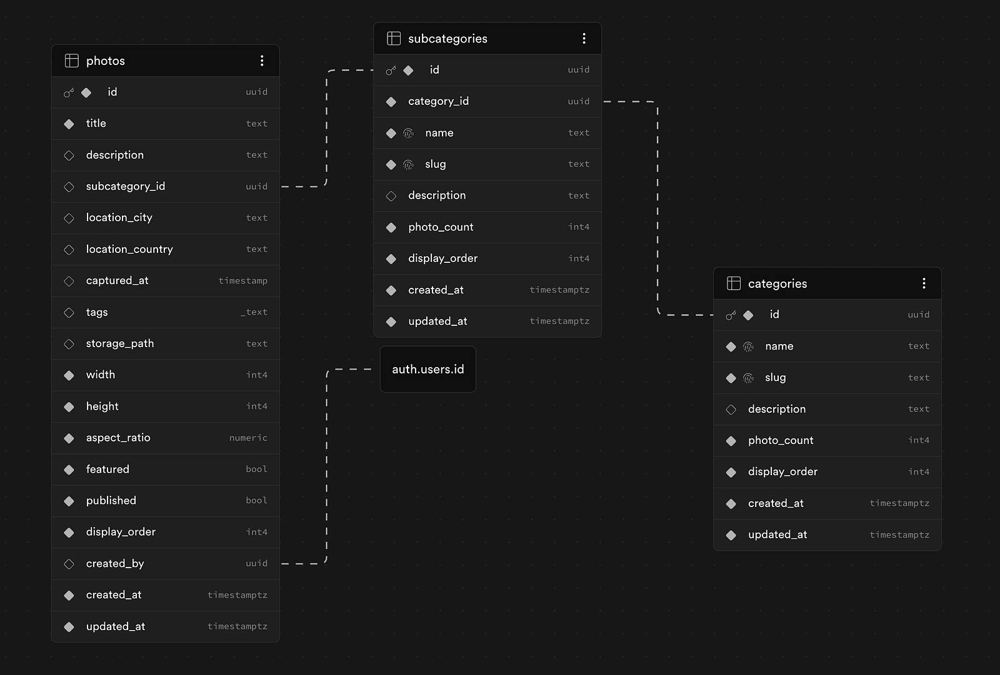
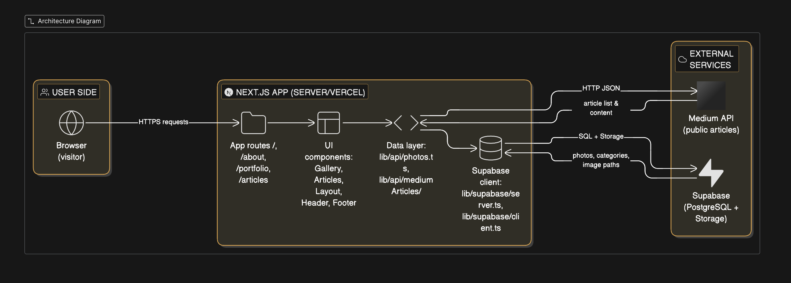

# Technical architecture

Tech stack choices and frontend/application architecture for Paria Creative Vision.
For product context (problem, goals, user flow), see
[project_description.md](./project_description.md).

---

## Tech stack & why

| Choice | What | Why |
|--------|------|-----|
| **Framework** | Next.js 16 (App Router) | SSR for SEO and fast first load; Server Components for data; single codebase for portfolio + future API. |
| **Language** | TypeScript | Type safety, refactor confidence, and alignment with Supabase-generated types. |
| **Styling** | Tailwind CSS v4 | Fast UI iteration, design tokens, small production CSS. |
| **Backend / data** | Supabase (PostgreSQL, Storage) | Managed Postgres + file storage, TypeScript type generation, no server to run. |
| **Animations** | Framer Motion | Declarative animations for gallery and lightbox. |
| **Icons** | Lucide React | Lightweight, consistent set. |
| **Build** | Turbopack | Faster dev and build. |

**Summary:** Next.js + Supabase keeps the stack modern and scalable with minimal ops; TypeScript + generated DB types keep the codebase maintainable.

---
## Data Model & Database Design
**Supabase**
  - PostgreSQL database
  - File storage
  - Authentication (optional)

**Database Design**
Entity–Relationship Diagram (ERD) of the portfolio database built on Supabase PostgreSQL.



---
## Frontend Architecture

**Separation of Concerns**
- Components - only handle UI: `src/components/`  
- Data/API: `src/lib/api/`  
- Types: `src/types/`  
- Static content: `src/data/`

**Scalability / Reusability**
- Keep components small and focused
- Use barrel files (`index.ts`) in component folders for cleaner imports
- Prefer feature-based folders plus a `shared/` folder for primitives reused across features (buttons, text blocks, icons).
- Next.js App Router structure with nested routes for portfolio filtering

### How the app works (step by step)

1. The user opens a route such as `/`, `/portfolio`, `/portfolio/[category]`, `/work/[slug]`, or `/articles`.
2. Next.js server components fetch data using `src/lib/api/*` functions.
3. Supabase returns database rows and image storage paths.
4. Server-rendered HTML is sent to the browser for fast first paint and SEO.
5. Client components hydrate for interactions (filter buttons, lightbox, mobile menu).
6. Portfolio filter clicks push new slug-based URLs; Next.js re-renders the server component with the new slug params.

### Top-level folder structure

```text
public/                        # Static assets served directly
docs/                          # Project documentation
src/
├── app/                          # Next.js App Router — four route groups
│   ├── layout.tsx                # Root shell (fonts only)
│   ├── globals.css               # @import "tailwindcss" + token file imports
│   │
│   ├── (portfolio)/              # Public photography portfolio
│   │   ├── layout.tsx            # Header + Footer layout
│   │   ├── page.tsx              # / — home page (hero + featured gallery)
│   │   ├── about/page.tsx
│   │   ├── articles/page.tsx     # Medium RSS, ISR revalidate 3600s
│   │   ├── portfolio/[[...slug]]/page.tsx  # /portfolio/[cat]/[sub] catch-all
│   │   └── work/
│   │       ├── page.tsx          # /work — case studies listing
│   │       └── [slug]/page.tsx   # /work/[slug] — individual case study
│   │
│   ├── (admin)/admin/            # Private photo CMS (Auth0-gated)
│   │   ├── layout.tsx            # AdminAuthGate + AdminSidebar
│   │   ├── page.tsx              # /admin
│   │   ├── upload/page.tsx       # /admin/upload — photo upload pipeline
│   │   ├── photos/page.tsx       # /admin/photos — photo grid + management
│   │   └── photos/[id]/edit/page.tsx  # /admin/photos/[id]/edit
│   │
│   ├── (talent-atlas)/talent-atlas/  # Hiring dashboard (Auth0 + role-based)
│   │   ├── layout.tsx            # Outer bare shell
│   │   ├── page.tsx              # Entry / redirect
│   │   └── (app)/                # Inner group with full layout
│   │       ├── layout.tsx        # QueryProvider + RealtimeSync + Header + Sidebar + AuthGate
│   │       ├── dashboard/page.tsx
│   │       ├── candidates/page.tsx    # /talent-atlas/candidates — kanban board
│   │       ├── campaigns/page.tsx
│   │       ├── companies/page.tsx
│   │       └── settings/page.tsx
│   │
│   ├── (verdikt)/verdikt/        # Early SaaS prototype
│   │   ├── layout.tsx
│   │   └── dashboard/page.tsx
│   │
│   └── api/                      # Next.js Route Handlers
│       ├── admin/photos/route.ts            # POST (upload) + GET
│       ├── admin/photos/[id]/route.ts       # PATCH + DELETE + revalidatePath
│       ├── talent-atlas/candidates/route.ts
│       ├── talent-atlas/candidates/[id]/route.ts  # PATCH stage + WS broadcast
│       ├── talent-atlas/campaigns/route.ts
│       └── talent-atlas/companies/route.ts
│
├── components/
│   ├── branding/Logo/
│   ├── features/                 # Feature-scoped components
│   │   ├── admin/                # AdminSidebar, AdminTopBar, UploadForm, PhotoGrid,
│   │   │                         #   PhotoCard, PhotoManager, EditPhotoForm, PhotoMetadataCard
│   │   ├── talentAtlas/          # TalentAtlasHeader, TalentAtlasSidebar, SidebarUserFooter,
│   │   │                         #   DashboardOverview, KanbanColumn, CandidateCard,
│   │   │                         #   AddCandidateForm, FeedbackBadge, RealtimeSync
│   │   ├── home/                 # Hero, FeaturedGallery, LatestArticles, SelectedWork
│   │   ├── portfolio/            # GalleryGrid, GalleryItem, GalleryFilters, Lightbox
│   │   ├── articles/             # ArticleCard, ArticleGrid, ArticleFilter, ArticleList
│   │   ├── work/                 # WorkCard, WorkGrid, WorkPageHero
│   │   │   └── workItemPage/     # WorkItemPageHero, WorkItemSidebar, WorkDeepDiveSection,
│   │   │                         #   KeyDecisionsSection, SitePreviewSection
│   │   └── about/                # ProfileCard, DualCardSection, AboutPageHero
│   ├── layout/                   # Header, Footer, Container, Body, Flex, Grid, Stack
│   ├── providers/                # QueryProvider, WebVitals
│   └── ui/                       # Button, Typography, CtaLink, SectionHeader, TextBlock,
│                                  #   Divider, DecorativeLine, Loading, BackNavigationLink, icons
│
├── data/
│   ├── staticData.ts
│   ├── aboutData.ts
│   ├── workData.ts
│   └── talentAtlasMockData.ts    # MOCK_CAMPAIGNS, MOCK_CANDIDATES, STAGE_LABELS, STAGE_COLORS
│
├── hooks/
│   ├── talent-atlas/
│   │   ├── useCandidates.ts      # useQuery + useUpdateCandidateStage (optimistic update)
│   │   ├── useCampaigns.ts
│   │   ├── useCompanies.ts
│   │   └── useRealtimeSync.ts    # Subscribes to wsStream, patches TanStack cache
│   ├── useRole.ts
│   ├── useWebSocket.ts
│   └── useHeaderScroll.ts
│
├── lib/
│   ├── api/
│   │   ├── admin/photos.ts       # Supabase admin photo queries (service role)
│   │   ├── photos/photos.ts      # Portfolio photo queries (anon key + RLS)
│   │   ├── workProjects/         # Work project queries
│   │   ├── mediumArticles/       # Medium RSS integration
│   │   └── apiUtils/apiUtils.ts  # Shared Postgrest error logging
│   ├── auth0/
│   │   ├── withAuth.ts           # HOF — reads session, checks roles, wraps handler
│   │   ├── session.ts            # getSessionOrRedirect, getAdminSessionOrRedirect
│   │   ├── auth0.ts              # Auth0 SDK instance
│   │   ├── roles.ts              # ROLES enum: ADMIN, COORDINATOR, COMPANY, CANDIDATE
│   │   └── __tests__/withAuth.test.ts
│   ├── realtime/
│   │   ├── wsStream.ts           # RxJS: Subject → filter(dedup) → bufferTime(200) → coalesce
│   │   └── __tests__/wsStream.test.ts
│   ├── schemas/talentAtlas.ts    # Zod schemas: CreateCampaign, CreateCandidate, UpdateStage
│   ├── store/talentAtlasStore.ts # In-memory singleton arrays (mock; replace with Supabase in prod)
│   ├── query/
│   │   ├── queryClient.ts        # TanStack Query client config (staleTime, refetchOnWindowFocus)
│   │   └── queryKeys.ts          # Centralised query key factory
│   ├── routes/routes.ts          # Centralised route path constants
│   ├── supabase/
│   │   ├── server.ts             # Server Component client (anon key + cookies)
│   │   ├── client.ts             # Browser client
│   │   └── static.ts             # Singleton for generateStaticParams (no cookies)
│   └── utils/utils.tsx
│
├── styles/                       # Global CSS split by domain
│   ├── tokens.css                # Design tokens: primitive → semantic → @theme Tailwind mapping
│   └── base.css                  # Minimal global defaults
│
└── types/
    ├── photo.types.ts
    ├── work.types.ts
    ├── ui.types.ts
    ├── ws.types.ts               # WsEvent discriminated union (all WebSocket event types)
    └── database.types.ts         # Auto-generated from Supabase schema (npm run supabase:types)
```

---
## System architecture

High-level view of how the browser, Next.js app, and external services work together.



---
## Build Tools

- **Turbopack** - Fast incremental builds used by Next.js for dev and build workflows.
---
## Deployment

- **Vercel** - Hosting and deployment target for this app.
