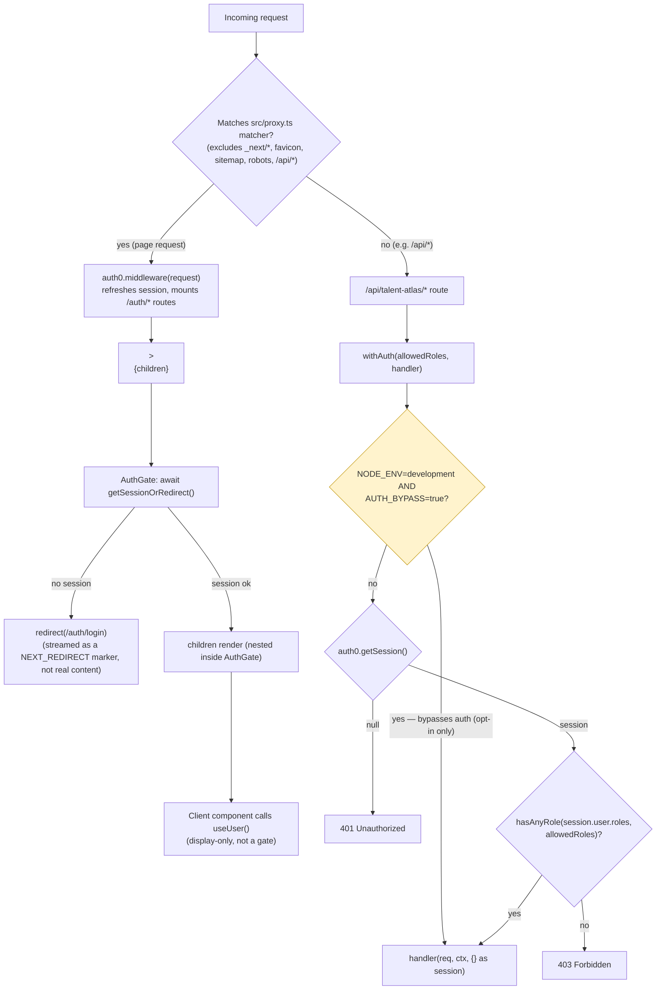

## Authentication

Purpose:
Protect Talent Atlas routes (pages + API) by Auth0 session and role.

Flow:

Login (`/auth/login`, mounted by proxy)
↓
Auth0 (hosted login)
↓
Callback (`/auth/callback`, mounted by proxy)
↓
proxy.ts (`auth0.middleware` — refreshes session; runs on every page request)
↓
`AuthGate` (Server Component in `TalentAtlasAppLayout`) — `await getSessionOrRedirect()`, then renders `children`
↓
`<Suspense fallback={<Loading />}><AuthGate>{children}</AuthGate></Suspense>` — streams the fallback, then either the redirect or the real page
↓
Page renders
↓
Client `useUser()` (display only, not a gate)

API requests instead go: route → `withAuth(roles, handler)` → session + role check → handler. See diagram below for both.

Files:

- src/proxy.ts
- src/lib/auth0/auth0.ts
- src/lib/auth0/withAuth.ts
- src/lib/auth0/session.ts
- src/lib/auth0/roles.ts
- src/app/(talent-atlas)/talent-atlas/(app)/layout.tsx — defines `AuthGate`, the actual page-level gate (see below)
- src/components/features/talentAtlas/SidebarUserFooter.tsx — also calls `getSessionOrRedirect()`, but only to read `session.user` for display; no longer the thing doing the gating (see below)

Things to remember:

- Env vars: `AUTH0_DOMAIN`, `AUTH0_CLIENT_ID`, `AUTH0_CLIENT_SECRET`, `AUTH0_SECRET`, `APP_BASE_URL` (set in `.env.local`, and now documented in `.env.example`)
- Callback URL: `/auth/callback`, auto-mounted by the proxy — not a route file in `src/app`
- Protected routes: determined by the `matcher` in `src/proxy.ts` (all pages except `_next/*`, favicon/sitemap/robots, `/api/*`) — but matching the proxy only refreshes the session, it doesn't block access
- Role claim `https://paria.eu/roles` must match exactly what the Auth0 Action sets on the ID token
- `withAuth` skips all checks only when **both** `NODE_ENV=development` **and** `AUTH_BYPASS=true` are set (`.env.local` / `.env.example`). Deploys via `vercel --prod` (see `.github/workflows/ci.yml`) get `NODE_ENV=production` automatically from Next.js's build — just make sure no `NODE_ENV` or `AUTH_BYPASS` override exists in the Vercel project's Environment Variables. (Fixed 2026-07-12: previously bypassed on `NODE_ENV=development` alone, a single ambient condition rather than a deliberate opt-in.)

### Auth0 tenant/dashboard setup

None of this lives in the repo — it's tenant configuration in the Auth0 dashboard. Needed to run auth at all, not just to read the code:

1. **Application** — type "Regular Web Application" (the Next.js SDK needs server-side token exchange, not SPA).
   - Allowed Callback URLs: `{APP_BASE_URL}/auth/callback`
   - Allowed Logout URLs: `{APP_BASE_URL}`
   - Allowed Web Origins: `{APP_BASE_URL}`
   - (add both `http://localhost:3000` and the deployed URL as separate entries if you need both to work)
2. **Application Keys** → map to env vars: Domain → `AUTH0_DOMAIN`, Client ID → `AUTH0_CLIENT_ID`, Client Secret → `AUTH0_CLIENT_SECRET`.
3. **`AUTH0_SECRET`** — not from the dashboard; generate locally (e.g. `openssl rand -hex 32`). Used to encrypt the session cookie. Must stay constant across restarts or existing sessions break.
4. **Post-Login Action (required)** — without this, every user gets `roles: []` and `hasAnyRole` always fails, so all API routes 403 in production.
   - Auth0 Dashboard → Actions → Flows → Login → add a custom Action that sets a custom claim on the ID token:
     ```js
     exports.onExecutePostLogin = async (event, api) => {
       const roles = event.authorization?.roles ?? [];
       api.idToken.setCustomClaim('https://paria.eu/roles', roles);
     };
     ```
   - The claim key **must** match `ROLES_CLAIM` in `src/lib/auth0/auth0.ts` exactly (`https://paria.eu/roles`) — there's no shared constant between the Action (dashboard-side) and this code, so a rename on one side silently breaks roles on the other.
5. **Roles** — create `Admin`, `Coordinator`, `Company`, `Candidate` under Auth0 → User Management → Roles (must match `src/lib/auth0/roles.ts` `ROLES` values), and assign them to users/apps as needed. `event.authorization.roles` in the Action above only populates if RBAC is enabled and the role is assigned to the user.
6. **Backchannel logout** (optional) — if enabled in the Auth0 app, point it at `{APP_BASE_URL}/auth/backchannel-logout`.

Provider:
src/lib/auth0/auth0.ts — Auth0Client, injects custom role claim (`https://paria.eu/roles`) from the ID token into the session on `beforeSessionSaved`

Roles:
src/lib/auth0/roles.ts — ROLES = Admin | Coordinator | Company | Candidate, plus `hasRole` / `hasAnyRole` helpers

API route guard:
src/lib/auth0/withAuth.ts — `withAuth(allowedRoles, handler)` wraps Next.js route handlers, checks session + role, returns 401/403.
⚠️ In `NODE_ENV=development` it skips the check entirely and calls the handler with `{}` as the session.

Page-level guard:
src/lib/auth0/session.ts — `getSessionOrRedirect()` redirects to `/auth/login` if no session.
Client-side:
`Auth0Provider` (from `@auth0/nextjs-auth0`) wraps the Talent Atlas app shell in `(talent-atlas)/talent-atlas/(app)/layout.tsx`; components use the `useUser()` hook (see `DashboardOverview.tsx`) for user info, not for route protection.

Entry points that use this:
- API: all `/api/talent-atlas/*` routes via `withAuth`
- UI: Talent Atlas app shell via `Auth0Provider`

Global proxy (Next.js 16 renamed `middleware.ts` → `proxy.ts`):
src/proxy.ts — runs `auth0.middleware(request)` on every request except `_next/static`, `_next/image`, `favicon.ico`, `sitemap.xml`, `robots.txt`, and `/api/*`.
This mounts the Auth0 SDK's built-in routes (`/auth/login`, `/auth/logout`, `/auth/callback`, `/auth/profile`, `/auth/access-token`, `/auth/backchannel-logout`) and manages session refresh — it does **not** itself redirect unauthenticated users off protected pages. Page-level gating is `AuthGate`, in `TalentAtlasAppLayout` (see "Page-level guard" above).

### Request flow

