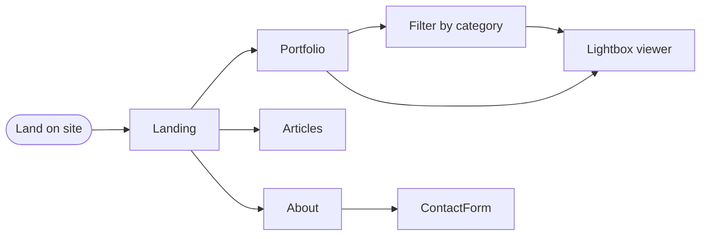

# Project: Paria.eu Portfolio

## Problem Statement

**Core Problem:** 
Build a portfolio website that allows users to explore Paria’s creative work — photography, code, articles - in a way that is easy to navigate, and informative, while highlighting the intersection of creativity and technology.

**Challenges:**
- **Portfolio Navigation:** Browse photography collections efficiently. Filtering by categories, etc.
- **Content Discovery:** Access articles about creative and technical processes in a readable way.
- **Engagement & Contact:** Easily contact Paria via accessible forms
- **Performance & Visual Experience:** Images should load fast, responsive layout and smooth scrolling are required. 
- **Showcasing Creativity Through Technology:** Design should highlight both technical skills and artistic vision.

## Goal / Desired Outcome
- Build a modern portfolio website
- filter by technology
- allow contact form

# Requirements

## Functional Requirement
- Browse photography projects
- Filter projects by category/tag
- Open project detail pages with description and images
- Access and read articles/blogs
- Contact form with validation
- Responsive layout (desktop + mobile)
- Smooth animations / interactions
- Error handling for broken images or failed form submissions

## Non-Functional Requirements
- Fast loading times
- Accessibility 
- SEO optimized (meta tags, structured data)
- Scalable architecture for future features
- Maintainable codebase (feature-based folder structure)

## Minimum Viable Product (MVP)

**MVP Features:**
- Static Home page with featured projects
- Static Portfolio pages with filter
- Static Article Page with filter
- About page
- Contact form (basic validation, static email action)
- Responsive layout

**Excluded from MVP (nice-to-have):**
- Dynamic database integration (Supabase)
- Filtering & search
- Blog/articles content management
- Lazy loading / image optimization
- Advanced animations

---

## User flow

**Primary user:** Visitor landing on the site to explore work or get in touch.

 

| Step | Action | Outcome |
|------|--------|--------|
| 1 | Lands on **Landing** | Sees hero and featured photos; can go to Portfolio, Articles, About, or Contact. |
| 2 | **Portfolio** | Browses gallery; can filter by category/subcategory; clicks a photo → lightbox. |
| 3 | **Lightbox** | Views image full-screen; can move prev/next or close. |
| 4 | **Articles** | Reads blog/list; can open an article. |
| 5 | **About** | Reads bio and context. |
| ?| **Contact** (in future) | Fills form (validation); submits to reach Paria. |

**Key paths:** Home → Portfolio (filter) → Lightbox | Home → Articles (filter) → open an article | Home → About.

Maybe | Home → Contact ?

---

## Tech stack

Next.js 16, TypeScript, Tailwind CSS v4, Supabase (PostgreSQL + Storage), Framer Motion, Turbopack. Full stack rationale and **frontend/application architecture** (routing, data flow, components, images, structure) → **[architecture.md](./architecture.md)**.