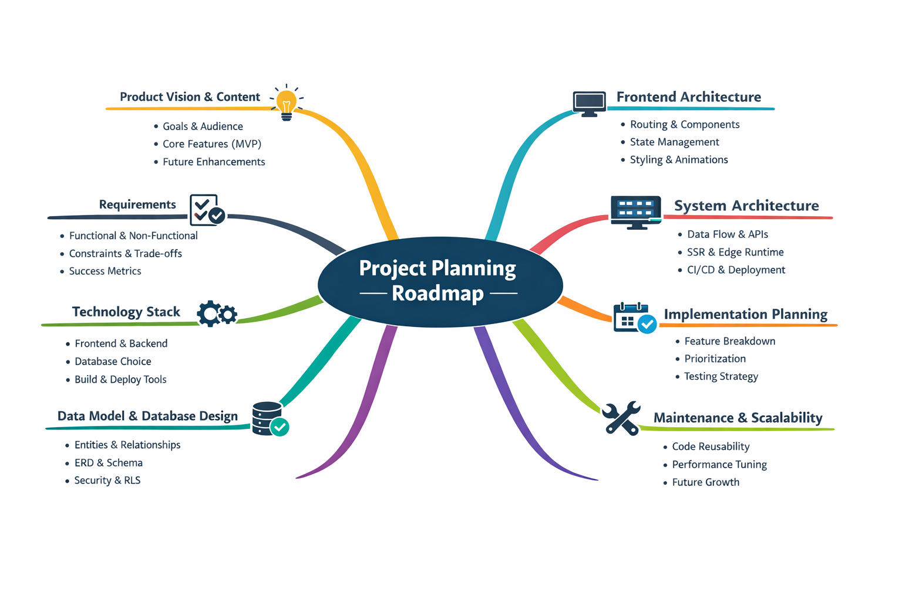

# Project: Paria.eu Portfolio
I created this mind map. It served as a roadmap from initial concept through database design, frontend and system architecture, to implementation and maintenance.

---
## Problem Statement

**Core Problem:** 
Build a portfolio website that allows users to explore Paria’s creative work — photography, code, articles - in a way that is easy to navigate, and informative, while highlighting the intersection of creativity and technology.

**Challenges:**
- **Portfolio Navigation:** Browse photography collections efficiently. Filtering by categories/subcategories, etc.
- **Content Discovery:** Show selected articles from the Medium profile in a readable format, with a link to read the full article on Medium.
- **Engagement & Contact:** Easily and quickly contact Paria through simple and accessible forms.
- **Performance & Visual Experience:** Images should load fast, responsive layout and smooth scrolling are required. 
- **Showcasing Creativity Through Technology:** Design should highlight both technical skills and artistic vision.

## Goal / Desired Outcome
- Build a modern portfolio website
- Filter photos by categories/subcategories
- Filter articles by technology 
- allow contact form with validation 
**... in progress ....**
- Providing context through projects, storytelling, and optional interactive features such as maps for travel trips.? (brainstorming)

---
## Requirements

### Functional Requirement
- Display photos in the portfolio
- Filter photos by category / subCategory.
- Access and read articles / insights
- Filter articles by category / subCategory.
- Contact form with input validation
- Responsive layout - all devices
- Smooth animations and interactive elements
- Error handling (example, broken images or failed form submissions)
**... in progress ....**
- Storytelling via Projects
    Include description, optional link, and interactive elements like maps ? (brainstorming)

### Non-Functional Requirements
**Performance**
- Fast loading times - Pages should load in under 2 seconds globally
- Images should be optimized and lazily loaded
- Static content should be served via SSG where possible

**Accessibility**
- Semantic HTML structure
- Keyboard navigation
- Alt text for images
- ARIA attributes where needed
- Lighthouse accessibility score > 90

**SEO**
- SEO optimized (meta tags, structured data)
- Pages must be search engine indexable
- Metadata and structured content should be optimized for discoverability

**Maintainability**
- Scalable architecture for future features
- Maintainable codebase (feature-based folder structure)
- The codebase should be fully typed using TypeScript

**Scalability (In future)**
- The system should allow easy addition of new projects and content
- The architecture should support future features such as blog posts or analytics

### Minimum Viable Product (MVP)

**MVP Features:**
- Static Home page with featured projects
- Static Portfolio pages with filter
- Static Article Page with filter
- About page
- Contact form (basic validation, static email action)
- Responsive layout

**Excluded from MVP (nice-to-have):**
- Dynamic database integration (Supabase)
- Filtering & search
- Articles Display – Medium Integration
- Lazy loading / image optimization
- Advanced animations
---

## User flow

**Primary user:** Visitor landing on the site to explore work or get in touch.

| Step | Action | Outcome |
|------|--------|--------|
| 1 | Lands on **Landing** | Sees hero and featured photos; can go to Portfolio, Articles, About. |
| 2 | **Portfolio** | Browses gallery; can filter by category/subcategory; clicks a photo → lightbox. |
| 3 | **Lightbox** | Views image full-screen; can move prev/next or close. |
| 4 | **Articles** | Reads insights/articles; can open an article. |
| 5 | **About** | Reads bio and context. |
| 6 | **Contact** (in future) | Fills form (validation); submits to reach Paria. |

**Key paths:** 
Home → Portfolio (filter) → Lightbox 
Home → Articles (filter) → open an article
Home → About.

Maybe | Home → Contact -> ContactForm  ?
Maybe | Home → About -> ContactForm ?

---

## Tech stack

Next.js 16, TypeScript, Tailwind CSS v4, Supabase (PostgreSQL + Storage), Framer Motion, Turbopack. Full stack rationale and **frontend/application architecture** (routing, data flow, components, images, structure) → **[architecture.md](./architecture.md)**.