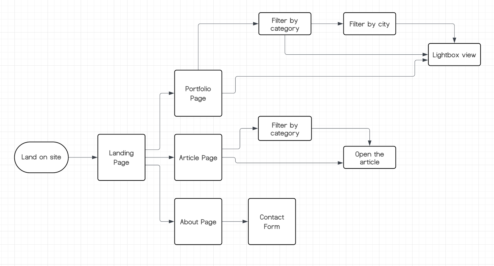
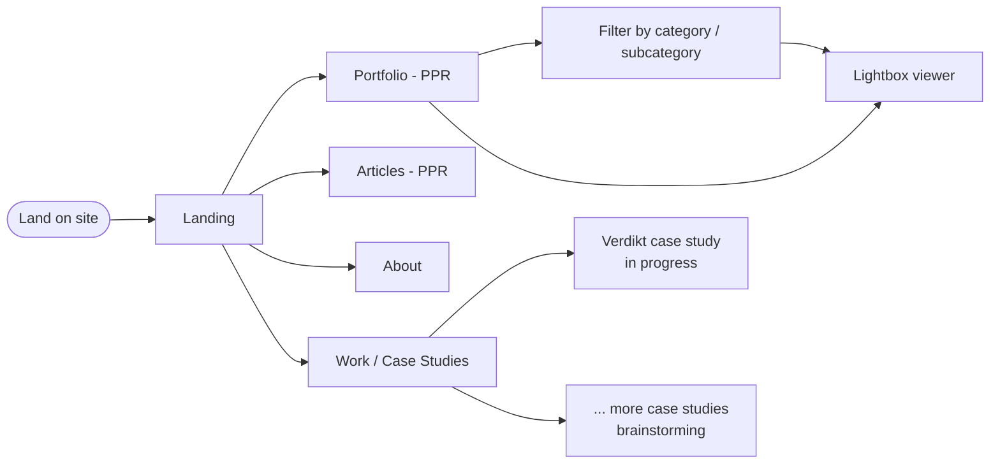

# Project: Paria.eu 
I created this mind map. It served as a roadmap from initial concept through database design, frontend and system architecture, to implementation and maintenance.

---
## Problem Statement

**Core Problem:** 
Build a portfolio website that allows users to explore Paria’s creative work — photography, code, articles - in a way that is easy to navigate, and informative, while highlighting the intersection of creativity and technology.

**Challenges:**
- **Portfolio Navigation:** Browse photography collections efficiently. Filtering by categories/subcategories, etc.
- **Content Discovery:** Show selected articles from the Medium profile in a readable format, with a link to read the full article on Medium.
- **Engagement & Contact:** Easily and quickly contact Paria through simple and accessible forms.
- **Performance & Visual Experience:** Images should load fast, responsive layout and smooth scrolling are required. 
- **Showcasing Creativity Through Technology:** Design should highlight both technical skills and artistic vision.

## Goal / Desired Outcome

**Shipped:**
- Modern portfolio website showcasing photography, writing, and engineering work
- Filter photos by category / subcategory
- Filter articles by technology category (Web Dev, AI)
- Work / case studies section to provide context through storytelling

**In progress:**
- Contact form with validation

**Brainstorming:**
- Richer project storytelling — optional interactive elements such as maps for travel/location-based work

---
## Requirements

### Functional Requirement
- Display photos in the portfolio
- Filter photos by category / subCategory.
- Access and read articles / insights
- Filter articles by category / subCategory.
- Contact form with input validation
- Responsive layout - all devices
- Smooth animations and interactive elements
- Error handling (example, broken images or failed form submissions)
**... in progress ....**
- Storytelling via Projects
    Include description, optional link, and interactive elements like maps ? (brainstorming)

### Non-Functional Requirements
**Performance**
- Fast loading times - Pages should load in under 2 seconds globally
- Images should be optimized and lazily loaded
- Partial Pre-Rendering (PPR) — static page shells are prerendered at build time; dynamic content (data fetches) streams in at request time via Suspense boundaries

**Accessibility**
- Semantic HTML structure
- Keyboard navigation
- Alt text for images
- ARIA attributes where needed
- Lighthouse accessibility score > 90

**SEO**
- SEO optimized (meta tags, structured data)
- Pages must be search engine indexable
- Metadata and structured content should be optimized for discoverability

**Maintainability**
- Scalable architecture for future features
- Maintainable codebase (feature-based folder structure)
- The codebase should be fully typed using TypeScript

**Scalability (In future)**
- The system should allow easy addition of new projects and content
- The architecture should support future features such as blog posts or analytics

### Minimum Viable Product (MVP)

**MVP Features (shipped):**
- Home page with featured projects (Supabase)
- Portfolio page with category / subcategory filtering — **PPR**: hero prerendered, gallery streams via Suspense (Supabase + SSR)
- Articles page with category filtering — **PPR**: hero prerendered, articles stream via Suspense (Medium RSS)
- About page (static)
- Work / case studies listing (static)
- Responsive layout
- Image optimization (Next.js Image + Supabase Storage CDN)
- Smooth animations (Framer Motion)

**In progress / brainstorming:**
- **Paria Creative Vision** (this website) — the portfolio itself is also a case study featured under `/work`; documents the design decisions, PPR architecture, and tech stack choices made during its own build
- Verdikt case study — B2B SaaS decision-approval workflow; portfolio write-up at `/work/verdikt` (see `docs/verdikt-prd.md`)
- Contact form

**Excluded from MVP:**
- Analytics
- Maps / interactive storytelling elements
---

## User flow

**Primary user:** Visitor landing on the site to explore work or get in touch.

> **Early design:** The diagram below was created at the start of the project as an initial user flow sketch. The Mermaid chart below reflects the current implemented state.

🔵 PPR = static hero prerendered at build time, dynamic content streams at request time via Suspense

| Step | Action | Outcome |
|------|--------|--------|
| 1 | Lands on **Landing** | Sees hero and featured photos; can navigate to Portfolio, Articles, Work, About. |
| 2 | **Portfolio** | Browses gallery; filters by category/subcategory; clicks a photo → lightbox. |
| 3 | **Lightbox** | Views image full-screen; navigates prev/next or closes. |
| 4 | **Articles** | Reads insights filtered by category; opens full article on Medium. |
| 5 | **Work** | Browses case studies listing. |
| 6 | **Work / Verdikt** | Reads Verdikt case study (in progress). |
| 7 | **About** | Reads bio and context. |

**Key paths:**
- Home → Portfolio (filter) → Lightbox
- Home → Articles (filter) → open on Medium
- Home → Work → case study
- Home → About

---

## Tech stack

Next.js 16 (with Partial Pre-Rendering via `cacheComponents`), TypeScript, Tailwind CSS v4, Supabase (PostgreSQL + Storage), Framer Motion, Turbopack. Full stack rationale and **frontend/application architecture** (routing, data flow, components, images, structure) → **[architecture.md](./architecture.md)**.